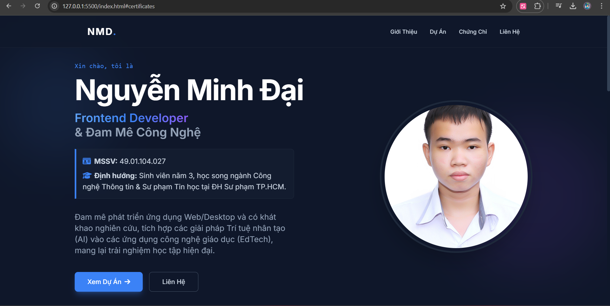

# Nguyễn Minh Đại - Personal Portfolio ✨

Chào mừng đến với Web Portfolio cá nhân của tôi! Đây là một nền tảng trực tuyến nhằm giới thiệu bản thân, các chứng chỉ thành tựu và đặc biệt là các dự án phần mềm nổi bật mà tôi đã và đang phát triển.

 <!-- Bạn có thể thay đường dẫn bằng ảnh chụp thực tế màn hình -->

## 🚀 Giới Thiệu
Dự án là một trang tĩnh dạng Single-page, được xây dựng theo phong cách thiết kế hiện đại, tối giản và chuyên nghiệp chuẩn kỹ sư IT (Dark Mode).
- **Tác giả:** Nguyễn Minh Đại (MSSV: 49.01.104.027)
- **Định hướng:** Phát triển ứng dụng Web/Desktop và tích hợp Trí tuệ nhân tạo (AI) vào các mảng công nghệ giáo dục (EdTech).

## 🛠 Công Nghệ Sử Dụng
Dự án được xây dựng mà không cần dùng đến framework hay bundler phức tạp, đề cao tốc độ và khả năng có thể chạy ngay trực tiếp trên mọi trình duyệt:
- **Ngôn ngữ lõi:** `HTML5` semantic.
- **Tiêu chuẩn thiết kế & CSS:** `Tailwind CSS` (tích hợp qua CDN) cho UI linh hoạt, responsive siêu tốc.
- **Iconography:** `Font Awesome 6` (CDN) cung cấp trọn bộ icon sắc nét.
- **Các tính năng UI/UX:** Glassmorphism Navbar, CSS Grid/Flexbox layouts, Smooth Scrolling.

## 📂 Cấu Trúc Thư Mục
Vì dự án đề cao sự đóng gói gọn gàng, toàn bộ hệ sinh thái của code đều nằm ở 1 file duy nhất.

```text
📁 NMDai-Portfolio
├── 📄 index.html      # Tệp HTML duy nhất chứa toàn bộ Layout, CSS (Tailwind config) & JS logic
└── 📄 README.md       # Tệp tài liệu cấu trúc bạn đang xem
```

## ⚡ Hướng Dẫn Cài Đặt & Sử Dụng

Không cần `npm install` hay quy trình build phức tạp!
1. **Clone dự án về máy:**
   ```bash
   git clone https://github.com/nmdai679/portfolio.git
   ```
2. **Khởi chạy:**
   Chỉ cần click đúp vào file `index.html` để mở ngay trên trình duyệt web của bạn (Chrome, Edge, Firefox, Safari).
   Hoặc nếu bạn sử dụng VS Code, có thể dùng extention `Live Server` để giả lập host chạy trang nhanh chóng.

## 🌐 Trải Nghiệm Live Demo
Bạn có thể xem bản Live Demo đã được Deploy lên GitHub Pages tại:
👉 **[Link Live Demo (Cập nhật sau)](https://nmdai679.github.io/portfolio)**

## 📬 Liên Hệ

Nếu có bất kỳ thắc mắc nào, hoặc muốn kết nối làm việc, vui lòng liên hệ với tôi qua:
* **GitHub:** [@nmdai679](https://github.com/nmdai679)
* **Email:** Liên hệ trực tiếp qua form tại Desktop/Mobile view của trang cá nhân.
* **LinkedIn:** Nơi tôi chia sẻ hành trình sự nghiệp và học thuật.
